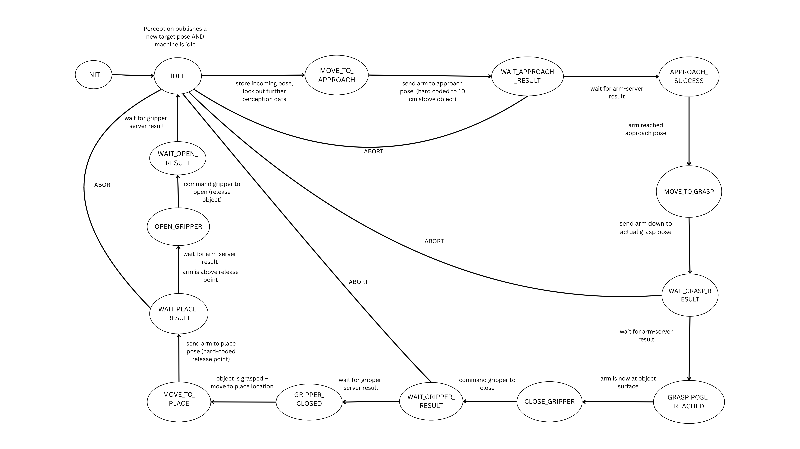

# Pick and Place FSM

This ROS2 package implements a Finite-State Machine (FSM) for a pick-and-place task. It is designed to work with an "Eddie" robotic arm but includes mock servers for testing without the actual hardware.

## Functionality

The core of this package is the `pick_place_fsm_mock` node, which implements the state machine logic. The FSM is illustrated below:




-   **IDLE**:  Wait for `/perception/target_pose`, once it arrives start the pick-and-place cycle..
-   **MOVE_TO_APPROACH**: Move the arm to an approach position near the object.
-   **WAIT_APPROACH_RESULT**: Block until arm-server confirms success/failure.
-   **MOVE_TO_GRASP**: Command arm to descend to the exact object pose, transition to waiting for result.
-   **WAIT_GRASP_RESULT**: Block until arm-server confirms success/failure.
-   **CLOSE_GRIPPER**: Send gripper-close goal (pos 100) and transition to waiting for result.
-   **WAIT_GRIPPER_RESULT** Block until gripper-server confirms success/failure.
-   **MOVE_TO_PLACE**: Move the arm to a pre-defined placing position.
-   **WAIT_PLACE_RESULT** Block until arm-server confirms success/failure
-   **OPEN_GRIPPER**: Open the gripper to release the object.
-   **WAIT_OPEN_RESULT**: Block until gripper-server confirms success/failure.
-   **FINISHED**: The sequence is complete, and the FSM returns to IDLE.
-   **ABORT**: The sequence was aborted due to an error. Reset state to `IDLE` and await next perception trigger.

The FSM is triggered by publishing a `geometry_msgs/msg/PoseStamped` message to the `/perception/target_pose` topic.


## mock_servers_only.cpp
-   Implements a mock ROS 2 node that simulates action servers for robotic arm and gripper control.
-   Implements rclcpp_action servers to accept, execute, and respond to action goals.
-   Every goal succeeds automatically after a short feedback loop 


## Running the FSM

You will need three terminals.

### 1. Source the Workspace

In each terminal, source your ROS2 workspace:

```bash
source install/setup.bash
```

### 2. Run the Servers (Terminal 1)

This will start the action servers for the arm and gripper.

```bash
ros2 run pick_place_fsm mock_servers_only
```
**OR**
```bash
ros2 launch eddie_ros eddie.launch.py ethernet_if:=<eth interface> arm_select:=right
```

### 3. Run the FSM (Terminal 2)

This will start the FSM client, which will wait for a perception message.

```bash
ros2 run pick_place_fsm pick_place_fsm_mock
```

### 4. Publish Perception Data (Terminal 3)

This will trigger the FSM to start the pick and place sequence. This example publishes a pose at (0.5, 0.5, 0.5).

```bash
ros2 topic pub --once /perception/target_pose geometry_msgs/msg/PoseStamped \
  "{header: {frame_id: camera}, pose: {position: {x: 0.0, y: 0.0, z: 0.01}, orientation: {x: 0.0, y: 0.0, z: 0.0, w: 1.0}}}"```
