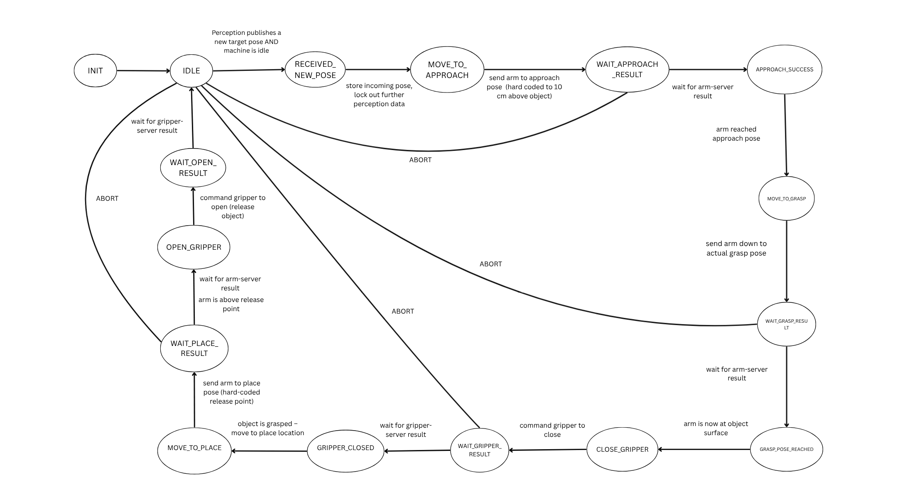

# Pick and Place FSM

This ROS2 package implements a Finite-State Machine (FSM) for a pick-and-place task. It is designed to work with an "Eddie" robotic arm but includes mock servers for testing without the actual hardware.

## Functionality

The core of this package is the `pick_place_fsm_mock` node, which implements the state machine logic. The FSM is illustrated below:



The FSM has the following states, as defined in `include/pick_place.fsm`:

-   **S_IDLE**: The FSM is waiting for a target pose.
-   **S_MOVE_TO_APPROACH**: Move the arm to an approach position near the object.
-   **S_WAIT_APPROACH_RESULT**: Wait for the arm movement to the approach position to complete.
-   **S_MOVE_TO_GRASP**: Move the arm to the final grasping position.
-   **S_WAIT_GRASP_RESULT**: Wait for the arm movement to the grasp position to complete.
-   **S_CLOSE_GRIPPER**: Close the gripper to grasp the object.
-   **S_WAIT_GRIPPER_RESULT**: Wait for the gripper to close.
-   **S_MOVE_TO_PLACE**: Move the arm to a pre-defined placing position.
-   **S_WAIT_PLACE_RESULT**: Wait for the arm movement to the place position to complete.
-   **S_OPEN_GRIPPER**: Open the gripper to release the object.
-   **S_WAIT_OPEN_RESULT**: Wait for the gripper to open.
-   **S_FINISHED**: The sequence is complete, and the FSM returns to IDLE.
-   **S_ABORT**: The sequence was aborted due to an error.
-   **S_EXIT**: The final state of the FSM.

The FSM is triggered by publishing a `geometry_msgs/msg/PoseStamped` message to the `/perception/target_pose` topic.

## ROS Topics and Actions

### Subscriptions

-   `/perception/target_pose` (`geometry_msgs/msg/PoseStamped`): The FSM subscribes to this topic to receive the target pose for the pick-and-place task.

### Actions

-   `right_arm/arm_control` (`eddie_ros/action/ArmControl`): The action server for controlling the arm movement.
-   `right_arm/gripper_control` (`eddie_ros/action/GripperControl`): The action server for controlling the gripper.


## Nodes

-   `pick_place_fsm_mock`: The main FSM client node.
-   `mock_servers_only`: A node that provides mock action servers for the arm and gripper, for testing purposes(without robot).

## FSM Definition and Code Generation

The behavior of the pick-and-place task is modeled as a Finite State Machine (FSM). The FSM is defined in the `include/pick_place.fsm` file using a custom Domain-Specific Language (DSL).

This DSL and the code generation tools are provided by the `coord-dsl` package. The `.fsm` file is used to generate the C++ header file `include/pick_place_fsm.hpp`, which contains the necessary data structures to represent the FSM.

The generated header is then included in the main application (`src/pick_place_fsm_mock.cpp`) and is used in conjunction with the `coord2b` library, which provides the runtime environment to execute the FSM.

### Generating the FSM Header

To modify the FSM, edit the `include/pick_place.fsm` file. After making changes, you must regenerate the C++ header file. This requires the `coord-dsl` package to be installed.

From the root of this package, run the following command:

```bash
textx generate include/pick_place.fsm --target fsm_cpp -o include/pick_place_fsm.hpp
```

## Dependencies

This package depends on the following packages:

-   `rclcpp`
-   `rclcpp_action`
-   `geometry_msgs`
-   `eddie_ros`: A custom package providing action definitions for the robot.
-   `coord2b`: Provides the FSM runtime library.
-   `coord-dsl`: Provides the tools to generate the FSM header from the `.fsm` definition file (needed for development/modification).

Ensure all dependencies are installed in your workspace before building.

## Building

To build this package, use `colcon`:

```bash
colcon build
```