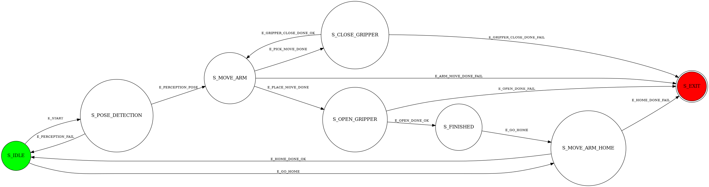

# Pick and Place FSM (Python)

This package contains a Python pick-and-place FSM client that talks to the arm/gripper action servers and delegates arm motion to the spline planner.

## FSM Overview



States (see `include/pick_place_py.fsm`):
- `S_IDLE` → waits for start
- `S_POSE_DETECTION` → listens for `/object_pose`
- `S_MOVE_ARM` → send arm motion (via spline planner action)
- `S_CLOSE_GRIPPER` → close on object
- `S_OPEN_GRIPPER` → release object
- `S_FINISHED` → success path
- `S_MOVE_ARM_HOME` → return home
- `S_EXIT` → terminal state

Key events: `E_START`, `E_PERCEPTION_POSE`, `E_PICK_MOVE_DONE`, `E_PLACE_MOVE_DONE`, `E_GRIPPER_CLOSE_DONE_OK`, `E_OPEN_DONE_OK`, `E_HOME_DONE_OK`, `E_ARM_MOVE_DONE_FAIL`, `E_HOME_DONE_FAIL`, `E_PERCEPTION_FAIL`, `E_GO_HOME`.

## Runtime Topics & Actions
- Subscribes: `/object_pose` (`geometry_msgs/PoseStamped`)
- Actions (real or mock):
  - `right_arm/arm_control` (`eddie_ros/ArmControl`)
  - `right_arm/gripper_control` (`eddie_ros/GripperControl`)
- Planner: `spline_plan` (`cartesian_planner/PlanSpline`) for generating/executing waypoints

## Quick Start
```
colcon build
source install/setup.bash
# Eddie interface depending on simulation or real hardware

ros2 run cartesian_planner spline_planner     # planner
ros2 run pick_place_fsm pick_place            # FSM client
```
### Refer [Detail steps](how_to_run.md) on how to run with complete robot setup

## Regenerating FSM Code(.fsm)
Requires `coord-dsl`:
```
textx generate include/pick_place_py.fsm --target fsm_py -o include/fsm_pick_place.py
```
