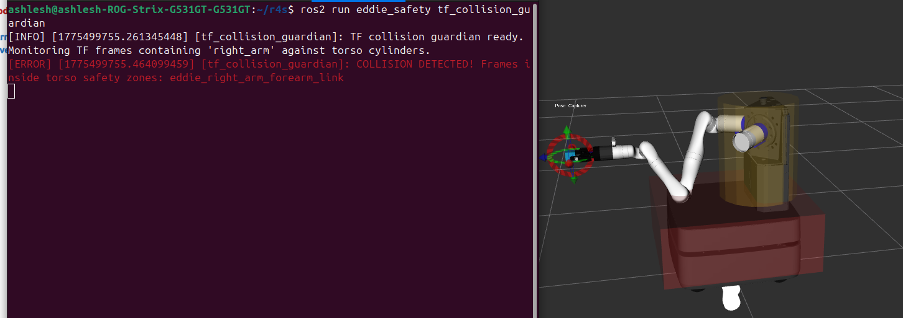

# Finite-State-Machine

ROS 2 package for the Eddie door-disassembly workflows.

## Package

- package name: `pick_place_fsm`
- workspace path: `/r4s/src/Finite-State-Machine`

## Main nodes

- [door_disassemble.py](src/door_disassemble.py)
  Main door disassembly FSM.
- [control_panel.py](src/control_panel.py)
  GUI launcher for FSM to control all nodes and packages
- [pick_place.py](src/pick_place.py)
  Pick-and-place FSM.
- [mock_perception_server.py](src/mock_perception_server.py)
  Mock `RunVision` action server for local testing.
- [screwdriver_pick.py](src/screwdriver_pick.py)
  Helper node used by `door_disassemble` for screwdriver pickup and probing.
- [pose_capturer.py](scripts/pose_capturer.py)
  Captures and saves named poses into JSON.
- [tf_collision_guardian.py](src/tf_collision_guardian.py)
  Standalone safety node to prevent self-collisions of the arm with the robot's base and torso.
- [error_handling.py](src/error_handling.py)
  Object Slip detection node

## Interfaces used

This package currently uses:

- `my_robot_interfaces/action/RunVision`
- `pick_place_fsm/srv/CaptureReference`
- `pick_place_fsm/srv/RunScrewdriverRoutine`

The door disassembly flow expects the perception action server on:

- `/run_perception_pipeline`

## Named poses

Named poses are stored in:

- [named_poses.json](src/named_poses.json)

Common keys:

- `home_pose`
- `table_drop_pose`
- `screwdriver_pose`
- `view_pose_unit`
- `view_pose_motor_grip`
- `view_pose_speaker`

## Build

```bash
cd ~/r4s
source /opt/ros/jazzy/setup.bash
colcon build
source ~/r4s/install/setup.bash
```

## Executables

```bash
ros2 run pick_place_fsm control_panel
ros2 run pick_place_fsm door_disassemble
ros2 run pick_place_fsm pick_place
ros2 run pick_place_fsm mock_perception_server
ros2 run pick_place_fsm screwdriver_pick
ros2 run pick_place_fsm pose_capturer
ros2 run pick_place_fsm eddie_safety
ros2 run pick_place_fsm error_handling
```

## Behaviour

At a high level, `door_disassemble` runs the door workflow as a state machine.

Typical runtime behavior:

1. waits in `IDLE` until the operator presses `Enter`
2. performs startup checks for action servers, services, and TF
3. moves to the configured view pose and object view poses
4. requests perception results for the target objects pose
5. optionally requests subdoor poses and raster-scan results for screw poses, depending on parameters
6. optionally triggers the screwdriver helper routine
7. selects the next detected object to pick
8. moves to a pre-pick pose for that object
9. advances to the pick pose using the perception result
10. closes the gripper to grasp the object
11. retreats with the grasped object
12. moves toward the table place , requests for place pose by tilting 45 degrees to preceive table to drop the object
13. opens the gripper to release the object
14. returns toward the view/home pose and repeats for the next object

## Door disassemble FSM

The door disassembly workflow is defined in three layers:

- [door_disassemble.fsm](include/door_disassemble.fsm)
  Source FSM definition containing states, events, transitions, and reactions.
- [fsm_door_disassemble.py](include/fsm_door_disassemble.py)
  Generated Python FSM representation used by the runtime node.
- [door_disassemble.py](src/door_disassemble.py)
  ROS 2 runtime node that executes the behavior associated with each FSM state.

In short:

- `door_disassemble.fsm` describes the FSM structure
- `fsm_door_disassemble.py` is the generated FSM code
- `door_disassemble.py` runs the robot logic on top of that FSM

Some important states in the workflow:

- `S_INITIALIZE`
  Checks required action servers, services, and TF before starting the workflow.
- `S_MOVE_TO_VIEW_POSE`
  Moves the arm to the configured home/view pose or object-specific view pose before perception.
- `S_GET_SUBDOOR`
  Requests subdoor poses when raster-scan flow is enabled.
- `S_GET_OBJECTS`
  Requests perception results for the target classes such as `unit`, `speaker`, and `motor_grip`.
- `S_RASTER_SCAN`
  Calls the raster scanner to obtain screw poses when enabled.
- `S_EXECUTE_SCREWDRIVER_PROBE`
  Triggers the screwdriver helper routine for pickup and probing behavior.
- `S_SELECT_NEXT_OBJECT`
  Chooses the next detected object to pick.
- `S_MOVE_TO_PICK_OBJECT`
  Builds the pre-pick and final pick motion from the perceived object pose.
- `S_CLOSE_GRIPPER`
  Grasps the selected object.
- `S_MOVE_TO_PLACE_POSE`
  Moves toward the placement area and uses table perception when that flow is enabled.
- `S_OPEN_GRIPPER`
  Releases the object at the place pose.
- `S_EXIT`
  Terminates the FSM after completion or abort.

## Diagram generation

Generate the door disassembly FSM diagram:

```bash
cd ~/r4s
python3 src/Finite-State-Machine/scripts/generate_fsm_diagram.py src/Finite-State-Machine/include/door_disassemble.fsm
```

Current diagram image:

- [door_disassemble_diagram.png](images/door_disassemble_diagram.png)


## Screwdriver pick helper

[screwdriver_pick.py](src/screwdriver_pick.py) is a helper node used by `door_disassemble` for screwdriver-related behavior.

What it does:

- exposes the service `/screwdriver_pick/run`
- requests screwdriver pose from perception when needed
- picks the screwdriver from the configured table-drop area
- if screw poses are provided, moves to probe poses derived from those screw poses
- publishes completion on `/screwdriver_pick/done`

## Eddie Safety Guardian

[tf_collision_guardian.py](src/tf_collision_guardian.py) (executable name `eddie_safety`) is a standalone safety node designed to prevent self-collisions for the Eddie robot.

What it does:

- Monitors the TF tree for frames containing a specific filter (e.g., `right_arm`), ignoring base and attachment links.
- Defines geometric restricted zones (a Base bounding box and an Upper Torso cylinder).
- Calculates if arm frames intrude into the restricted zones.
- Publishes a safety status boolean (`True` for safe, `False` for collision) to the `/robot_safety/status` topic.
- Publishes visualization markers to the `/robot_safety/torso_zones` topic for RViz debugging.



## Running

Detailed run instructions are in:

- [how_to_run.md](how_to_run.md)

That document covers:

- simulation flow
- real robot flow
- perception dependency
- raster scanner dependency
- screwdriver helper node
- pose capture workflow
